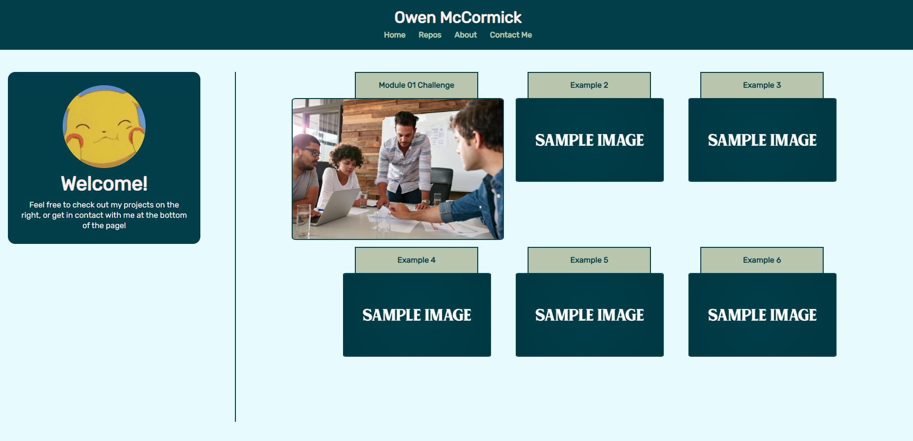

# Module 02 Challenge

This repository contains the HTML and CSS code for my first go at a portfolio website, made for the Module 02 Challenge.

## Table of Contents

- [Introduction](#introduction)
- [Installation](#installation)
- [What is it?](#what-is-it?)
- [Usage](#usage)
- [Credits](#credits)
- [License](#license)

## Introduction

The HTML code in this repository functions as a mock portfolio for myself. As of now, there is only one project listed, with 5 more example projects listed along with it. 

## Installation

N/A

## What is it?

This challenge was meant to have us use things like flexbox and the other css tools we have learned to create an interactive website that is clean and responsive. This site
uses interactive buttons to send users to each project, as well as give a basic introduction to myself with some contact info.

## Usage

See commented lines in the HTML and CSS files to see exactly what is going on under the hood. Website is hosted [here.](https://nephh.github.io/portfolio-template)

### Website Screenshot

## Credits

Font "Rubik" used is from Google Fonts.

## License

Please refer to the license in the repo
